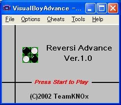
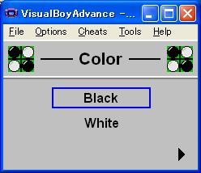
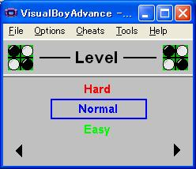
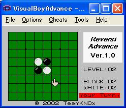
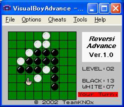
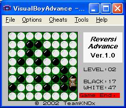

# Reversi for GBA
Reversi for Gameboy Advance

<table>
<tr>
<td></td>
<td></td>
<td></td>
</tr>
</table>

<table>
<tr>
<td></td>
<td></td>
<td></td>
</tr>
</table>

## BONSAI-Ware
Usually, developed software is excuted on flash cartridge with GBA itself. However, Flash Cartridge is very expensive. GBA can excute not only Flash Cartridge but also Internal RAM with boot functionarity. It is possible to execute with our developed ULA. 

### What's BONSAI ?
Do you know BONSAI ? Nice description is [here](https://en.wikipedia.org/wiki/Bonsai). BONSAI realizes a world and universe in a very small pot with limited resource. 

# License
Copyright (c) Osamu OHASHI  
Distributed under the MIT License either version 1.0 or any later version. 

